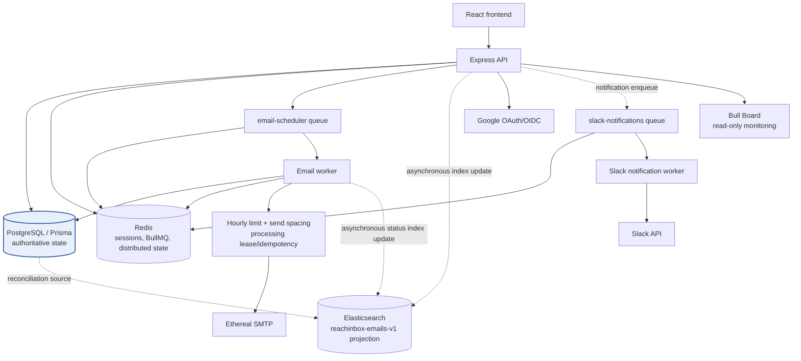

# ReachInbox Scheduler

ReachInbox Scheduler is a full-stack email scheduling assignment. Users authenticate with Google, create campaigns, and schedule individual recipient emails. PostgreSQL stores the authoritative application and email state; Redis and BullMQ provide durable asynchronous work; Ethereal SMTP is used for development delivery.

## Key features

- Google OAuth 2.0 Authorization Code + OIDC authentication with PKCE and Redis-backed opaque sessions.
- Campaign scheduling with one PostgreSQL `Email` record and one delayed BullMQ job per recipient.
- Email worker processing leases, deterministic job IDs, idempotency protection, retries, UTC-hour rate limiting, and per-sender spacing.
- Ethereal SMTP delivery for development and testing.
- Asynchronous Elasticsearch projection and authenticated email search.
- Slack OAuth, encrypted bot-token storage, channel selection, and asynchronous notifications.
- Read-only Bull Board monitoring for the email and Slack queues.
- React/Vite dashboard UI with scheduled, sent, search, compose, and CSV recipient flows.

## Architecture



PostgreSQL is the source of truth. Redis stores sessions, BullMQ state, leases, and distributed throttling state. Elasticsearch is only a searchable, eventually consistent projection. Authentication is request-scoped and does not affect email or Slack workers.

## Technology stack

- Node.js 22 Alpine container, TypeScript, Express 5
- React 19, Vite 7, TypeScript, Tailwind CSS
- PostgreSQL 16 and Prisma 7 with the PostgreSQL driver adapter
- Redis 7, ioredis, BullMQ 5
- Elasticsearch 8.15.5 and `@elastic/elasticsearch` 8.x
- Nodemailer with Ethereal SMTP
- Google `google-auth-library`
- Zod, Helmet, CORS, and Pino
- Docker Compose for local PostgreSQL, Redis, Elasticsearch, and backend services

## Repository structure

```text
.
├── backend/
│   ├── prisma/                 # schema, migrations, development seed
│   ├── src/
│   │   ├── admin/              # read-only Bull Board
│   │   ├── config/             # environment, logger, SMTP
│   │   ├── controllers/        # HTTP controllers
│   │   ├── db/                 # Prisma, PostgreSQL, Redis, Elasticsearch
│   │   ├── middleware/         # auth, errors, 404
│   │   ├── queues/             # email and Slack BullMQ queues
│   │   ├── routes/             # HTTP route registration
│   │   ├── services/            # scheduling, auth, search, Slack, limits
│   │   └── workers/             # email and Slack workers plus tests
│   ├── Dockerfile
│   └── package.json
├── frontend/
│   ├── src/                    # React application and API client
│   └── package.json
├── docker-compose.yml
├── PROJECT_TRACKER.md
└── README.md
```

## Prerequisites

- Node.js 22 or another current Node.js LTS compatible with the project.
- npm.
- Docker and Docker Compose.
- Google Cloud OAuth credentials for real login testing.
- A Slack app for Slack OAuth testing.
- An Ethereal Email test account for SMTP testing.

## Environment configuration

Never commit `.env` files or real credentials. Copy the example files and fill in local values:

```bash
cp backend/.env.example backend/.env
cp frontend/.env.example frontend/.env
```

The backend reads `backend/.env` when run directly. Docker Compose reads the root `.env` for Compose interpolation and passes the resolved values to the backend container. The Compose service hostnames are `postgres`, `redis`, and `elasticsearch`; direct host development normally uses `localhost`.

### Backend variables

| Variable | Required | Purpose / default |
| --- | --- | --- |
| `NODE_ENV` | No | `development`, `test`, or `production`; defaults to `development`. |
| `PORT` | No | HTTP port; defaults to `3000`. |
| `LOG_LEVEL` | No | Pino log level; defaults to `info` when set through the process environment. |
| `CORS_ORIGIN` | No | Allowed frontend origin; defaults to `http://localhost:5173`. |
| `FRONTEND_URL` | No | OAuth callback redirect target; defaults to `http://localhost:5173`. |
| `DATABASE_URL` | Yes | PostgreSQL connection URL. |
| `REDIS_URL` | Yes | Redis connection URL. |
| `ELASTICSEARCH_URL` or `ELASTICSEARCH_NODE` | Yes | Elasticsearch URL; Compose uses `http://elasticsearch:9200`. |
| `ELASTICSEARCH_USERNAME`, `ELASTICSEARCH_PASSWORD` | No | Elasticsearch credentials when security is enabled. |
| `ELASTICSEARCH_RECONCILIATION_INTERVAL_MS` | No | Projection reconciliation interval; defaults to `60000`. |
| `WORKER_CONCURRENCY` | No | Email worker concurrency; defaults to `5`. |
| `EMAIL_SEND_DELAY_MS` | No | Minimum per-sender send-start spacing; defaults to `2000`. |
| `PROCESSING_LEASE_MS` | No | Processing lease duration; defaults to `300000`. |
| `ETHEREAL_USER`, `ETHEREAL_PASSWORD` | Yes | Development SMTP credentials. |
| `ETHEREAL_HOST`, `ETHEREAL_PORT`, `ETHEREAL_SECURE` | No | Development SMTP settings; host and port default to Ethereal host and `587`, secure defaults to `false`. |
| `GOOGLE_CLIENT_ID`, `GOOGLE_CLIENT_SECRET`, `GOOGLE_REDIRECT_URI` | Optional feature group | Configure all three together to enable Google OAuth. |
| `SLACK_CLIENT_ID`, `SLACK_CLIENT_SECRET`, `SLACK_REDIRECT_URI`, `SLACK_TOKEN_ENCRYPTION_KEY` | Optional feature group | Configure the Slack OAuth trio and a 64-hex-character AES-256-GCM key together. |
| `SLACK_API_TIMEOUT_MS` | No | Slack API timeout; defaults to `10000`. |
| `SLACK_NOTIFICATION_CONCURRENCY` | No | Slack worker concurrency; defaults to `2`. |
| `SLACK_NOTIFICATION_ATTEMPTS` | No | Slack queue attempts; defaults to `3`. |
| `SESSION_COOKIE_NAME` | No | Session cookie name; defaults to `reachinbox_session`. |
| `SESSION_TTL_SECONDS` | No | Session lifetime; defaults to `604800`. |
| `OAUTH_STATE_TTL_SECONDS` | No | OAuth state lifetime; defaults to `600`. |
| `SESSION_COOKIE_SECURE` | No | Secure cookie flag; forced on in production and normally `false` for local HTTP. |

The Compose file also defines `POSTGRES_DB`, `POSTGRES_USER`, `POSTGRES_PASSWORD`, `POSTGRES_PORT`, `REDIS_PORT`, `ELASTICSEARCH_PORT`, and `BACKEND_PORT` with development defaults. These control the Docker services and Compose-generated backend connection URL; direct backend startup uses `DATABASE_URL`.

### Frontend variables

| Variable | Required | Purpose / default |
| --- | --- | --- |
| `VITE_API_BASE_URL` | No | Backend origin; defaults to `http://localhost:3000`. |
| `VITE_USE_MOCK_DATA` | No | Optional UI mock mode; set `false` for backend integration. |
| `VITE_DEFAULT_SENDER_ID` | Required to compose locally | UUID of an owned backend `Sender`; there is currently no sender-list endpoint. |

## Local setup

Start only the development infrastructure:

```bash
docker compose up -d postgres redis elasticsearch
```

Then configure and run the backend directly:

```bash
cd backend
npm install
npm run prisma:generate
npx prisma migrate deploy
npm run build
npm run db:seed
npm run dev
```

The seed creates or updates `dev@reachinbox.local` and its `sender@ethereal.email` sender. It imports the built Prisma module, so run `npm run build` before `npm run db:seed`.

Run the frontend in a second terminal:

```bash
cd frontend
npm install
npm run dev
```

Open `http://localhost:5173`. If WSL cannot reach Docker-published PostgreSQL or Redis ports, run the backend through the Compose service instead of directly from WSL.

## Docker setup

To build and run the complete development stack:

```bash
docker compose up --build -d
```

Services and ports:

- Backend: `http://localhost:3000`
- PostgreSQL: `localhost:5432`
- Redis: `localhost:6379`
- Elasticsearch: `http://localhost:9200`

PostgreSQL, Redis, and Elasticsearch use named persistent volumes: `postgres_data`, `redis_data`, and `elasticsearch_data`. All three have healthchecks, and the backend waits for healthy dependencies. Elasticsearch security is disabled in Compose for local development only.

With the backend container running, apply migrations using its Docker-network connection:

```bash
docker compose exec backend npx prisma migrate deploy
```

Do not use `docker compose down -v` unless you intentionally want to delete local database, Redis, and Elasticsearch data.

## Database and migrations

The Prisma schema is in `backend/prisma/schema.prisma`. Current models are `User`, `Sender`, `Campaign`, `Email`, and `SlackConnection`. Email statuses are `SCHEDULED`, `PROCESSING`, `SENT`, and `FAILED`.

Migrations are in `backend/prisma/migrations/`:

- `20260829112000_init`
- `20260829180000_add_processing_lease`

Useful commands from `backend/`:

```bash
npm run prisma:validate
npm run prisma:generate
npx prisma migrate deploy
npm run prisma:migrate
```

PostgreSQL remains authoritative for ownership, status, scheduling timestamps, and delivery state.

## Backend commands

From `backend/`:

```bash
npm run dev          # watch mode
npm run build        # compile TypeScript to dist/
npm start            # run dist/server.js
npm run typecheck    # strict typecheck without emitting
npm test             # backend test suite
npm run db:seed      # idempotent development seed; build first
```

## API documentation

All API errors use a JSON shape such as `{ "error": "message" }`. Protected routes require the application session cookie. Dates are serialized as ISO strings in JSON responses.

### Authentication

| Method | Path | Auth | Purpose |
| --- | --- | --- | --- |
| `GET` | `/auth/google` | Public | Starts Google OAuth and redirects to Google. |
| `GET` | `/auth/google/callback` | Public | Validates the code/state, creates a session cookie, and redirects to `FRONTEND_URL`. |
| `POST` | `/auth/logout` | Public/idempotent | Deletes the current Redis session when present and clears the cookie. |
| `GET` | `/auth/me` | Required | Returns `{ user: { id, email, name, avatarUrl } }`. |

Google OAuth uses `openid email profile`, Redis one-time state, S256 PKCE, and OIDC ID-token verification. The browser receives only an HttpOnly opaque session cookie, not Google tokens.

### Campaigns and emails

| Method | Path | Auth | Purpose |
| --- | --- | --- | --- |
| `POST` | `/api/campaigns` | Required | Creates a campaign and schedules one email per recipient. |
| `GET` | `/api/emails/scheduled` | Required | Lists the authenticated user’s scheduled emails ordered by `scheduledAt` ascending. |
| `GET` | `/api/emails/sent` | Required | Lists the authenticated user’s sent emails ordered by `sentAt` descending. |
| `GET` | `/api/emails/search` | Required | Searches the user’s Elasticsearch projection, then hydrates canonical PostgreSQL records. |

Campaign request body:

```json
{
  "subject": "string",
  "body": "string",
  "recipients": ["recipient@example.com"],
  "senderId": "owned-sender-uuid",
  "startTime": "2026-08-30T20:00:00.000Z",
  "delaySeconds": 2,
  "hourlyLimit": 50
}
```

The response contains `campaignId`, `scheduledCount`, and email metadata with `id`, `recipient`, `scheduledAt`, and `status`. The server derives ownership from the session and verifies that `senderId` belongs to that user. Invalid input returns `400`; missing ownership resources return `404`; scheduling infrastructure failures return `503`.

Search query parameters include `q`, `status`, `senderId`, `campaignId`, `from`, `to`, `page`, and `limit` (`page` defaults to `1`, `limit` to `20`, maximum `100`). The response contains `items` and `{ page, limit, total, totalPages }`. Elasticsearch outages return `503`; normal scheduled and sent listings remain PostgreSQL-backed.

### Slack

| Method | Path | Auth | Purpose |
| --- | --- | --- | --- |
| `GET` | `/auth/slack` | Required | Starts Slack OAuth v2 for the current application user. |
| `GET` | `/auth/slack/callback` | Required | Consumes session-bound state and persists the encrypted workspace connection. |
| `GET` | `/api/slack/connection` | Required | Returns safe connection status, team ID, and selected channel ID. |
| `GET` | `/api/slack/channels` | Required | Lists available public/private channels from Slack. |
| `PATCH` | `/api/slack/connection/channel` | Required | Selects an available channel; body is `{ "channelId": "..." }`. |
| `DELETE` | `/api/slack/connection` | Required | Removes the local connection and best-effort revokes the Slack token. |

Slack OAuth uses `chat:write`, `channels:read`, and `groups:read`. Tokens are encrypted at rest, never returned to the frontend, and never placed in BullMQ job data.

### Queue administration

| Method | Path | Auth | Purpose |
| --- | --- | --- | --- |
| `GET` | `/admin/queues` | Required | Read-only Bull Board UI for `email-scheduler` and `slack-notifications`. |

Bull Board is mounted behind the existing application session middleware. Its adapters use read-only mode so destructive queue controls are not exposed.

## Email scheduling and worker lifecycle

Campaign creation first commits the campaign and email rows in one PostgreSQL transaction. Each email then receives a deterministic job ID, `email-{emailId}`, and an individual delayed `send-email` job. PostgreSQL and Redis do not share a distributed transaction: if queue creation fails, the failure is persisted and the API returns an error rather than pretending the campaign was fully scheduled. Reconciliation can recover scheduled rows whose deterministic jobs are missing.

The normal lifecycle is:

```text
SCHEDULED -> PROCESSING -> SENT
                    |
                    +--> FAILED (permanent/final failure)
                    |
                    +--> SCHEDULED -> future delayed job (retry or rate-limit reschedule)
```

The worker atomically claims `SCHEDULED` records and records `processingLeaseUntil`. An active lease prevents another healthy worker from processing the same email. An expired lease can be reclaimed after a crash. A heartbeat renews the lease while work is in progress. A bounded recovery pass checks scheduled database rows for missing or stale BullMQ jobs.

The worker reserves a sender’s current UTC-hour slot in Redis using an atomic Lua script. The effective limit is the lowest active campaign limit participating in that sender’s current hour. Reservations are revalidated near SMTP start so a reservation cannot authorize a send in a later hour. A separate short Redis coordination gate reserves the actual send-start timestamp and is released as soon as SMTP begins; it is not held across the SMTP network request.

Email jobs use three attempts with exponential backoff starting at 5 seconds. Permanent SMTP errors become `FAILED`; transient SMTP failures return the email to `SCHEDULED` and are rethrown for BullMQ retry. The worker never claims exactly-once external delivery: SMTP may accept a message immediately before a process crash prevents the `SENT` update, leaving an inherent at-least-once duplicate window.

Cron is not used. BullMQ delayed jobs persist scheduling state in Redis, PostgreSQL stores durable email state, and the worker’s recovery pass repairs queue drift.

## Idempotency and reliability

- PostgreSQL email IDs identify individual recipient records.
- `idempotencyKey` is unique in PostgreSQL.
- BullMQ jobs use deterministic `email-{emailId}` IDs.
- Processing leases and optimistic status updates prevent healthy workers from claiming the same email concurrently.
- `SENT` records are skipped if a duplicate job is observed.
- Rate-limit and spacing reservations are atomic Redis operations.
- SMTP side effects cannot participate in a PostgreSQL transaction, so exactly-once delivery is not claimed.

Task 15 added integration-style reliability coverage using real Docker-network PostgreSQL and Redis with a fake SMTP transport. The focused suite passed 9/9 twice. The full backend suite passed 50/50 in the Compose network.

## Elasticsearch

The index is `reachinbox-emails-v1`. It has explicit keyword/date/text mappings, including `userId` as a keyword for ownership filtering. PostgreSQL email IDs are Elasticsearch document IDs.

Index updates are fire-and-forget with bounded retries and never run inside PostgreSQL transactions. Email creation and SMTP processing continue if Elasticsearch is unavailable. Startup initialization ensures the index/mapping exists, and periodic reconciliation reindexes PostgreSQL records to repair missing or stale documents.

Search first asks Elasticsearch for matching IDs filtered by authenticated `userId`, status and optional filters. It then loads those IDs from PostgreSQL, applies a final ownership check, and returns canonical PostgreSQL data in Elasticsearch hit order.

## Slack notifications

The `slack-notifications` queue and separate Slack worker handle `campaign_scheduled`, `campaign_scheduling_failed`, `email_sent`, and `email_failed` events. Retries, rate-limit delays, spacing delays, and lease renewals do not create notifications. Slack enqueueing and delivery are best effort and isolated from email delivery: Slack failures do not fail an email job or alter PostgreSQL email status.

## Testing and verification

Backend tests use Node’s test runner through `tsx`; frontend tests cover recipient parsing and the API client. Run:

```bash
cd backend
npm install
npm run typecheck
npm run build
npm test

cd ../frontend
npm install
npm run typecheck
npm run build
npm test
```

The final Task 15 verification also ran `git diff --check`, `docker compose config --quiet`, live Docker service health checks, and `/health`. Do not treat a host-side test run as an integration test when the host cannot reach the Docker-published Redis/PostgreSQL ports; run the relevant suite inside the Compose network.

## Security considerations

- Application sessions are opaque random IDs stored in Redis; only the ID is in an HttpOnly cookie.
- Cookies use SameSite=Lax and are Secure in production.
- Google and Slack OAuth state is random, short-lived, bound to the application session where applicable, and consumed atomically.
- Google ID tokens are checked for issuer, audience, subject, email, and verified email status.
- Slack bot tokens are encrypted with AES-256-GCM at rest.
- OAuth credentials, SMTP credentials, session IDs, and access tokens are not returned to the frontend or intentionally logged.
- Campaign, sender, scheduled-email, sent-email, and search ownership is enforced server-side.
- Bull Board is authenticated and read-only.
- `.env` files are ignored and must never be committed.

## Known limitations

- Google OAuth requires real Google Cloud credentials, consent configuration, and the exact callback URL `http://localhost:3000/auth/google/callback` for local testing.
- Slack OAuth requires a configured Slack app with callback URL `http://localhost:3000/auth/slack/callback`.
- Ethereal is development/test SMTP, not a production mail provider.
- SMTP delivery has an unavoidable crash window between provider acceptance and the PostgreSQL `SENT` update.
- There is no sender-list API yet; local compose uses `VITE_DEFAULT_SENDER_ID`, which must be an owned sender UUID.
- Elasticsearch is eventually consistent and search is unavailable with a `503` while the index service is unavailable.
- Some existing Slack notification event IDs contain `:`. BullMQ rejects those custom job IDs, so those notifications may be logged as not queued; this does not fail the email pipeline and remains a follow-up issue.
- Current npm audit reports four high-severity findings. Do not run `npm audit fix --force`; its suggested dependency changes are breaking upgrades.

## Assignment and demo notes

For a demo, start Docker, apply migrations, seed the development sender, configure frontend/backend `.env` files, and use Google OAuth with an actual configured account. Use Ethereal’s preview URLs or inbox to inspect test delivery. Demonstrate delayed jobs and worker state in `/admin/queues`, while treating PostgreSQL as the authoritative record of email status.

## Project status

Tasks 1–15 are complete and committed. Task 16 is the current final setup and documentation task. See [PROJECT_TRACKER.md](PROJECT_TRACKER.md) for the milestone tracker, implementation summaries, commit history, and submission checklist.
